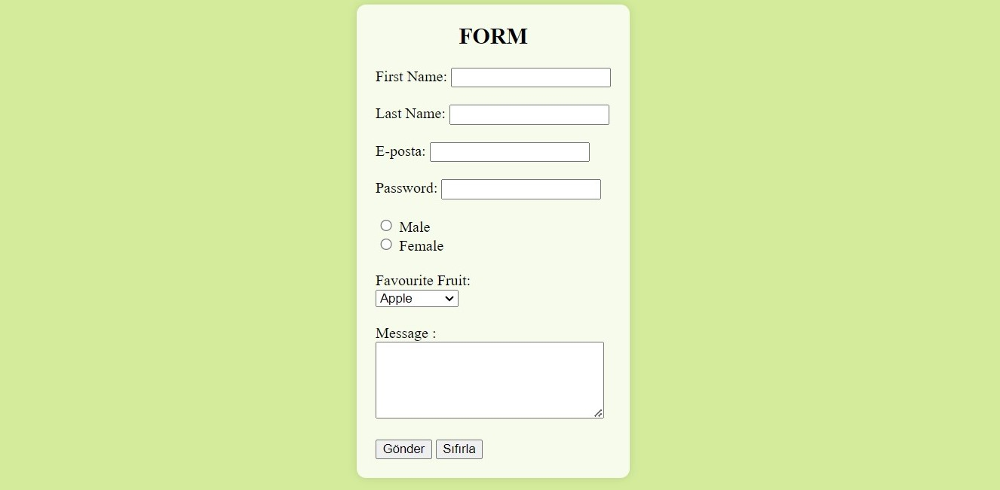

# Form Elements Example

This project demonstrates the use of various form elements in HTML, including text inputs, email inputs, password inputs, radio buttons, dropdown menus, textareas, and submit/reset buttons.

## Preview

