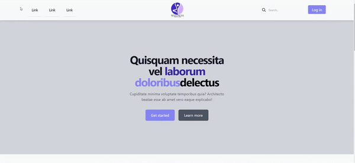

# Review Page
## Project Description
This project is a responsive review page using Tailwind CSS and JavaScript. It features a navigation bar, hero section, testimonials, contact form, and footer. The design ensures a smooth and visually appealing experience on all devices, with a focus on mobile responsiveness.

You can view a live demo of the project here. [Live Demo](https://reviewpages.netlify.app/)

## Features
- **Responsive Design:** The page is designed to be fully responsive, adapting seamlessly to different screen sizes and devices.
- **Navigation Bar:** Includes a hamburger menu for mobile devices and a search bar with a login button for larger screens.
- **Hero Section:** Features a prominent heading and call-to-action buttons.
- **Testimonials:** Displays customer reviews in a grid layout, each with a stylized quote and customer information.
- **Contact Form:** Allows users to send a message through a form that includes fields for name, email, and message.
- **Footer:** Contains navigation links and social media icons for easy access to additional information and social platforms.

## Technologies Used
- **HTML5:** The backbone structure of the page.
- **Tailwind CSS:** Utilized for styling and ensuring a responsive layout.
- **JavaScript:** Implemented for interactive elements such as the mobile navigation toggle.
- **Font Awesome:** Icons used throughout the project for visual enhancement.