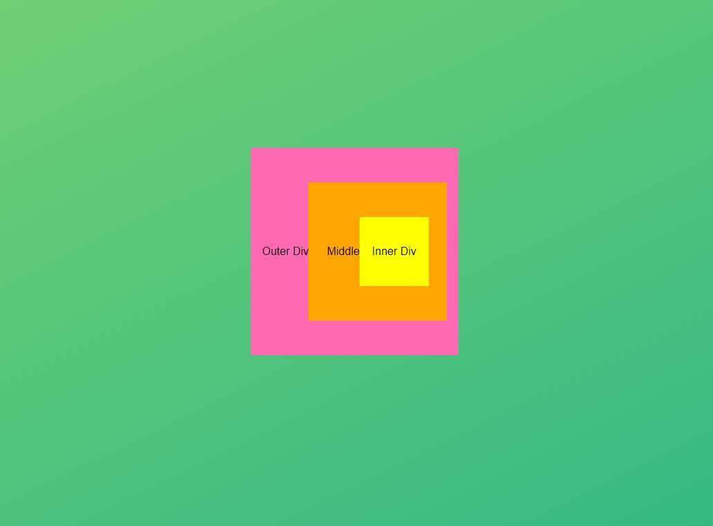

# Event Propagation Example

This project demonstrates the concept of event propagation in JavaScript, specifically focusing on stopping the propagation of events. The project consists of three nested `div` elements, each with a click event listener. The click events are logged to the console, and propagation is stopped at the innermost `div`.
## 

## Structure

- `outer` div: The outermost container.
- `middle` div: The middle container nested inside the outer div.
- `inner` div: The innermost container nested inside the middle div.

## Functionality

- Clicking on any of the `div` elements will log a message to the console indicating which `div` was clicked.
- The `inner` div's click event stops the propagation of the event using the `stopPropagation` method, ensuring that only the `inner` div's click event is logged when it is clicked.