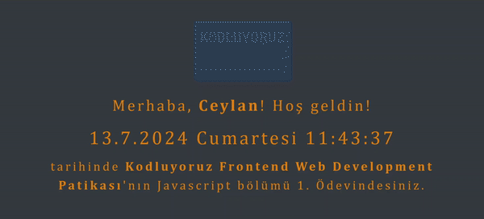

# Time & Greeting App

## Overview
This project is a simple web application that greets the user and displays the current time. The user can input their name, and upon submission, a personalized greeting is shown along with a real-time clock.

## 
 
## Features
- Input field for the user's name
- Personalized greeting message
- Real-time clock displaying the current date and time

## Technologies Used
- HTML
- CSS
- JavaScript
- Bootstrap

## File Structure
- **index.html:** The main HTML file containing the structure of the app.
- **style.css:** 
The CSS file for styling the application.
- **clock.js:** 
The JavaScript file handling the clock functionality and user interactions.