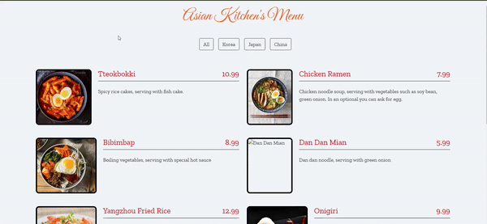

# Asian Kitchen Menu Project
This project displays a variety of delicious Asian dishes, categorized by their origin country. Users can filter the menu by category to view specific dishes. The project is built using HTML, CSS, JavaScript, and the Bootstrap framework for styling.

## Features
- Display a list of menu items with images, descriptions, and prices.
- Filter menu items by category (e.g., Korea, Japan, China).
- Responsive design for various screen sizes.

## Technologies Used
- **HTML5**: For the basic structure of the website.
- **CSS3**: For styling the website.
- **JavaScript**: For dynamic content and functionality.
- **Bootstrap**: For responsive design and additional UI components.

## Key JavaScript Concepts

### Spread Operator with Map and Filter

The **spread operator** (`...`) in JavaScript allows an iterable (like an array or string) to be expanded in places where zero or more arguments (for function calls) or elements (for array literals) are expected. It's particularly useful when working with array methods like `map` and `filter` to create new arrays without mutating the original data.
