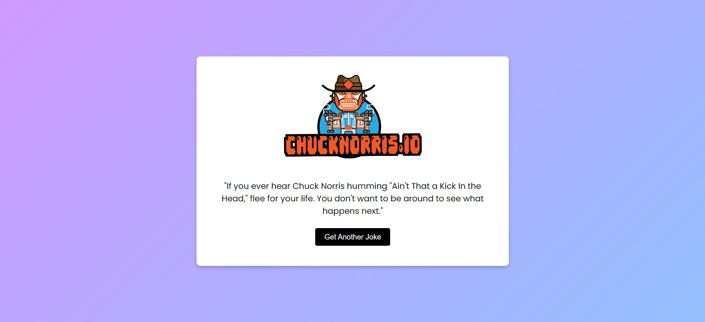

# Chuck Norris Jokes

## Overview
This project is a simple web application that displays Chuck Norris jokes. It utilizes the Chuck Norris Joke API to fetch random jokes and allows users to get a new joke by clicking a button. The application is built using HTML, CSS, and JavaScript.
## Demo
You can try the live demo of the ChuckNorris API project [here](https://chuck-norriss-api.netlify.app/).

## Features
- Displays a random Chuck Norris joke on page load.
- Allows users to fetch a new joke by clicking a button.
- Styled with Poppins font and includes an image of Chuck Norris.

## Technologies Used
- **HTML**: For the structure of the web page.
- **CSS**: For styling the page. Utilizes the Poppins font from Google Fonts.
- **JavaScript**: For fetching jokes from the API and updating the page content dynamically.
- **Chuck Norris Joke API**: Provides random Chuck Norris jokes.

## Key JavaScript Concepts
- **Fetch API**: Used to make HTTP requests to the Chuck Norris Joke API.
- **Event Listeners**: Used to handle user interactions, such as button clicks.
- **DOM Manipulation**: Used to update the content of the web page dynamically.
